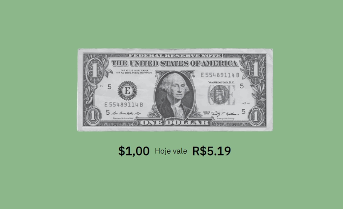

# Projeto DolarHoje

## No que se consiste esse projeto?
- Um projeto que ultiliza uma api para pegar o valor do dolar atual

## Como rodar o projeto?
- apos baixar o projeto e com o Node instalado, digite esse codigo:
```javascript
npm i
```
E logo após a instalação das dependencias digite:
```javascript
node Server.js
```
E abra o link que irá aparecer no console (localhost:3000)

## imagem do projeto:



